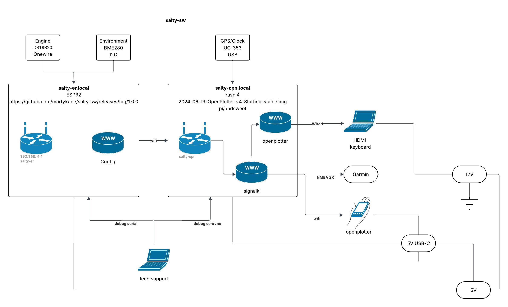

# Salty Software

 A SenseSP project for an engine temperature sensor.



## Local build

If you have a repo-local virtualenv with PlatformIO installed, build the default firmware target with:

```bash
.venv/bin/pio run -e pioarduino_esp32
```

## SenseSP

Based on the template for [SensESP](https://github.com/SignalK/SensESP/) projects. 

Comprehensive documentation for SensESP, including how to get started with your own project, is available at the [SensESP documentation site](https://signalk.org/SensESP/). 

To customize the template for your own purposes, edit the `src/main.cpp` and `platformio.ini` files.
